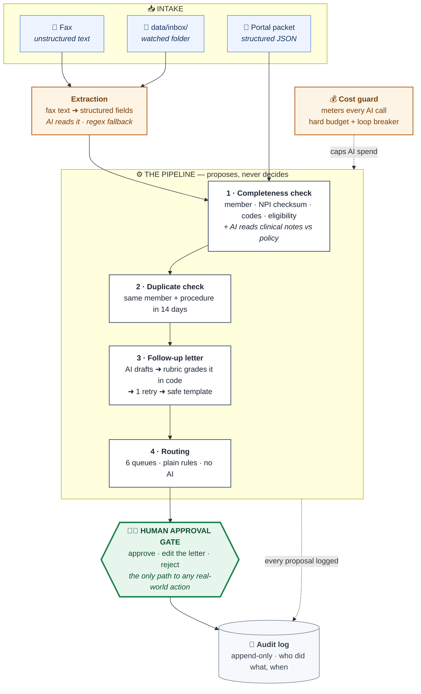

<div align="center">

# 🏥 Prior Authorization Intake Workflow Agent

**Catches missing information the moment a request arrives — so doctors aren't chased three times for three different things.**


*FDE Cohort 5 Capstone · Track 2 · Every piece of data here is fabricated — no production data, no PHI.*

</div>

---

## What problem does this solve?

Before an insurer pays for an expensive procedure, the doctor has to ask permission first. That request is called a **prior authorization**, and someone at the insurer has to check it by hand: *is everything here that we need?*

Very often, something is missing — a member ID, a diagnosis code, or a required test buried in the clinical notes. So the insurer writes back to the doctor. Days pass. The reply arrives, still incomplete. They write back again.

**Every one of those round-trips costs days**, burns the regulatory clock the insurer is legally held to, and often ends in a denial that gets overturned on appeal anyway — meaning everyone did the work twice.

> 💡 **The insight this project is built on:** intake is the cheapest place in the entire chain to fix this. Catching a missing TB screening on day 0 costs almost nothing. Discovering it on day 12, after a denial and an appeal, costs enormously.

**This agent reads every request the moment it arrives, finds everything that's missing in one pass, writes a single follow-up letter asking for all of it at once, and routes the case — with a human approving every outbound action.**

---

## How it works



**Read it in one line:** a request arrives → gets checked → gets a letter drafted if something's missing → gets routed → **a human approves it** → everything is logged.

---

## The one design decision that matters

> **Plain rules do the checking. AI only reads language.**

| Handled by **plain code** ⚙️ | Handled by **AI** 🤖 |
|---|---|
| Is the member ID present and in our eligibility list? | Do these clinical notes actually satisfy the policy? |
| Is the doctor's NPI mathematically valid? *(real checksum)* | Write the follow-up letter to the doctor |
| Is the diagnosis code a real ICD-10 format? | *(that's it — only these two)* |
| Is this a duplicate of a recent request? | |
| **Which queue does this case go to?** | |

**Why:** routing decisions affect someone's healthcare timeline, so a regulator must be able to read the exact rule that made them. Rules are free, instant, and provable. AI is used only where reading comprehension is genuinely required — and even there, its output is checked by code before a human sees it.

### 🎯 The example that shows the value

A doctor requests **adalimumab**, an expensive biologic drug. The policy requires three things: a confirmed diagnosis, proof that methotrexate was tried first, and a **negative TB screening** — because this drug can reactivate dormant tuberculosis.

The notes document the diagnosis ✅ and the methotrexate ✅ … and never mention TB screening ❌.

A keyword search can't reliably catch that. The AI reads the notes like a person would, flags exactly that gap, and the letter asks for exactly that — nothing invented. *(Try it: `python -m src.pipeline PA-2026-0018`)*

---

## What it can do

| Feature | What it means |
|---|---|
| 📠 **Reads faxes** | Turns unstructured fax text into clean structured fields. Anything it can't find becomes empty — it never guesses |
| 🔍 **Finds what's missing** | 12 kinds of problem: identity, eligibility, invalid NPI, bad codes, unjustified urgency, insufficient clinical notes |
| 👯 **Spots duplicates** | Same member + same procedure within 14 days → its own review queue, so nobody chases a doctor about a case that already exists |
| ✉️ **Writes the follow-up** | One letter covering everything missing — one round-trip instead of three |
| 🧭 **Routes the case** | 6 queues: no-auth-needed, duplicate review, eligibility team, provider outreach, expedited clinical, standard clinical |
| 🧑‍⚖️ **Requires a human** | Nothing is ever sent automatically. A named reviewer approves, edits, or rejects |
| ⚡ **Reacts to arrivals** | Drop a file in a folder and it flows through the pipeline into the review queue by itself |
| 💰 **Can't overspend** | Every AI call is metered; a hard budget and a loop breaker degrade it to offline rules instead of burning money |
| 🔌 **Runs without AI** | No API key? Deterministic fallbacks take over and the whole thing still works, end to end |
| 🧾 **Logs everything** | Append-only trail of every proposal and every human decision |

---

## The review console

`streamlit run app/review_app.py` opens a four-tab workspace:

| Tab | What you see |
|---|---|
| 📋 **Review Queue** | A visual trace of each case through the pipeline; findings badged **⚙️ RULE** or **🤖 AI**; a red/green field checklist; the editable letter with a live diff of your changes; Approve / Reject |
| 📊 **Dashboard** | How many cases are pending, approved, rejected · cases per route · **live AI spend against its budget cap** |
| 🧾 **Audit Trail** | Every proposal and decision, with who and when |
| 🎯 **Evals** | The scores from the latest test run, right inside the product |

---

## How we know it works

Testing an AI system means proving it, not trusting it. Three layers:

### 1️⃣ A golden answer key the system can't see

The dataset is generated by a script that deliberately breaks things — **27 packets and 2 faxes across 15 scenarios**. Because the script *creates* each problem, it also knows the right answer, and writes it to `data/golden_labels.json`.

> 🔒 That answer key is read **only** by the scoring script. The pipeline never sees it, so it cannot cheat.

### 2️⃣ Four metrics, scored on every run

| Metric | The question it answers | Why it matters |
|---|---|---|
| **Precision** | Of the problems we flagged, how many were real? | False alarms create the exact provider frustration we're trying to reduce |
| **Recall** | Of the real problems, how many did we catch? | A missed problem becomes a downstream delay |
| **Routing accuracy** | Did every case land in the right queue? | Wrong queue = wrong team = wasted days |
| **Letter rubric** | Was each drafted letter valid? | See the rubric below |
| **AI call integrity** | Were the AI calls *actually* answered by AI? | Explained below — this one has a story |

### 3️⃣ The letter rubric — how a draft is graded

Every AI-drafted letter is graded **by code, not by another AI**, against three mechanical rules:

| ✅ Rule | What it prevents |
|---|---|
| Every finding is covered by a question | A letter that forgets to ask about one missing item → another round-trip |
| No question references anything we didn't flag | The AI inventing requirements the policy never asked for |
| The letter references the case ID | An untraceable letter |

A failed draft gets **one retry** with the specific failures as feedback. Fail twice and the system throws the draft away and uses a safe pre-written template. Only then does it reach the human.

### 📊 Results

| Mode | Precision / Recall / F1 | Routing | Letter rubric | AI call integrity |
|:--|:--|:--|:--|:--|
| **Offline** (rules only) | 100% / 100% / 100% | 29 / 29 | 16 / 16 | — |
| **With AI** (Gemini) | 100% / 100% / 100% | 26 / 26 | 15 / 15 | **38 / 38 real AI calls** |

Plus **26 automated tests** covering the NPI checksum, routing priorities, fax extraction, duplicate logic, and the budget guard.

> ### 🐛 The bug that made the evals honest
>
> An early "AI mode" run scored a perfect 100%. It was wrong. The free-tier API was rate-limiting us, and the system's *graceful fallback* was quietly answering half the calls with offline rules — so the run wasn't measuring AI at all, and nothing said so.
>
> The fix was two parts: wait out rate limits instead of falling back, **and add the "AI call integrity" metric** that reports how many calls were genuinely served by the model. It proved itself immediately — the very next run showed `0/38`, exposing a model ID that Google listed but wouldn't actually serve.
>
> **An evaluation that can't detect its own dilution isn't an evaluation.** That metric now runs on every scored run.

---

## How to run this

**You need:** Python 3.10 or newer. **You don't need:** an API key, a database, Docker, or an internet connection.

### Step 1 · Install *(~1 min)*

```bash
git clone https://github.com/VidhansheeK/pa-intake-workflow-agent.git
cd pa-intake-workflow-agent

python3 -m venv .venv
source .venv/bin/activate          # Windows: .venv\Scripts\activate
pip install -r requirements.txt
```

### Step 2 · Verify *(~30 sec)*

```bash
pytest tests/                # expect: 26 passed
python evals/run_evals.py    # expect: 100% detection · 29/29 routing · 16/16 rubric
```

Both green? Everything works. You're in **offline mode** — the AI steps use deterministic fallbacks so the whole project is reviewable with no API key.

### Step 3 · Watch it handle real cases

```bash
python -m src.pipeline PA-2026-0001    # ✅ complete → straight to clinical review
python -m src.pipeline PA-2026-0012    # ❌ missing member ID → letter drafted
python -m src.pipeline PA-2026-0018    # 🔬 notes missing the required TB screening
python -m src.pipeline PA-2026-0027    # 👯 duplicate of an earlier request
python -m src.pipeline --fax data/faxes/FAX-0002.txt   # 📠 starts from a raw fax
```

Each prints the findings, the proposed route and why, and the drafted letter. All of it is a *proposal* — nothing is final.

### Step 4 · Open the review console

```bash
streamlit run app/review_app.py        # → http://localhost:8501
```

### Step 5 · *(Optional)* Event-driven intake

In a **second terminal**:

```bash
source .venv/bin/activate
python -m src.watcher                  # watches data/inbox/
```

Then drop a document in and watch it appear in the queue:

```bash
cp data/faxes/FAX-0001.txt data/inbox/
```

### Step 6 · *(Optional)* Turn on real AI

```bash
cp .env.example .env
```

Paste **one** key into `.env`:

```
GEMINI_API_KEY=AIza...          # free — https://aistudio.google.com/apikey
# or
ANTHROPIC_API_KEY=sk-ant-...    # paid alternative
```

Re-run anything above: the header flips from `mode: offline` to `mode: gemini`, and letters show `source: llm`. Spend is capped by `PA_BUDGET_USD` *(default $1)* — at the cap the agent falls back to offline rules rather than overspending.

<details>
<summary><b>🔧 Troubleshooting</b></summary>

| Problem | Fix |
|---|---|
| `command not found: python` | Use `python3` |
| `ModuleNotFoundError` | Virtualenv isn't active — `source .venv/bin/activate` |
| `streamlit: command not found` | Same cause, or run `python -m streamlit run app/review_app.py` |
| Port 8501 in use | `streamlit run app/review_app.py --server.port 8502` |
| Reset the demo state | `rm -rf data/proposals data/decisions.json audit_log.jsonl` |
| Regenerate the dataset | `python data/generate_packets.py` *(seeded — identical every time)* |

</details>

---

## What's inside

```
├── src/
│   ├── extract.py        📠 fax text → structured fields
│   ├── completeness.py   🔍 the checks (rules + the AI clinical-notes read)
│   ├── duplicates.py     👯 duplicate detection
│   ├── followups.py      ✉️  letter drafting + the rubric loop
│   ├── router.py         🧭 the 6-queue decision table
│   ├── pipeline.py       ⚙️  orchestrator + CLI
│   ├── watcher.py        ⚡ event-driven intake
│   ├── llm.py            🤖 AI providers, offline fallback, cost guard
│   └── audit.py          🧾 append-only log
├── app/review_app.py     🧑‍⚖️ the human approval console
├── evals/run_evals.py    🎯 scoring against the golden set
├── tests/                ✅ 26 tests
├── data/                 📦 generator · policies · 27 packets · 2 faxes · answer key
└── docs/                 📐 architecture diagram · submission brief
```

📄 **[DESIGN.md](DESIGN.md)** — requirements, architecture, enterprise readiness, cost & scaling
📓 **[BUILD_LOG.md](BUILD_LOG.md)** — every problem hit and every decision made, recorded as it happened
🤖 **[AI_USAGE.md](AI_USAGE.md)** — how AI was used to build this and where humans stayed in the loop

---

## Honest limitations

- **No image OCR.** We extract from fax *text*; a scan-to-text step would sit in front. The extraction layer already treats input as untrusted, so it slots in without pipeline changes.
- **6 procedures, not hundreds.** The policy catalog is a file standing in for the real policy system of record.
- **The offline keyword fallback can be fooled** by negation ("no physical therapy attempted"). That's why it's a fallback — the AI path handles it.
- **The answer key and the data share an author.** Mitigated by hand-reviewed scenarios and tests that encode expectations independently.
- **Deliberately not built:** gold-carding trusted providers, richer duplicate matching, tone-quality review of letters. Named, scoped, and left out on purpose.

## Where it goes next

**Learn from the approval gate.** Every time a reviewer edits a drafted letter, that edit is a labeled example of where the AI fell short — already captured in the audit log. Feeding those back into the prompts, with the eval harness as the regression gate, is how this gets better on its own.

<div align="center">

---

*Built for the UHC Tech / Optum Forward Deployed Engineer Cohort 5 Capstone.*
*All data synthetic. No production data. No PHI.*

</div>
